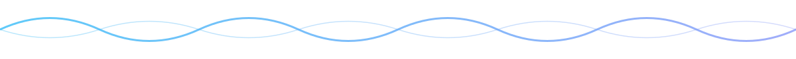

<div align="center">



<a href="https://git.io/typing-svg"></a>

<p>
  <a href="https://www.linkedin.com/in/nakshatra-garg"></a>
  <a href="mailto:gargnakshatra11@gmail.com"></a>
  
</p>

</div>

---

## 👋 About Me



I'm a **Data Scientist / AI Engineer at [Rezo.AI](https://rezo.ai)** with **3+ years** of building production **LLM** and **Voice AI** systems for enterprise clients.

I love the hard part of AI — taking models out of notebooks and making them **fast, cheap, safe and reliable at scale**.

- 🔭 Currently owning a **self-hosted open-weight LLM** on **vLLM + NVIDIA H200s**, serving **~2.5M calls/day**
- 🌱 Working on **in-house ASR & TTS** data and training pipelines
- 🎓 M.Tech CSE (AI & ML minor), **VIT Vellore** · B.Tech IT, **COER Roorkee**
- 📍 Noida, India
- 💬 Ask me about **LLM inference, RAG, guardrails, voice bots**
- ⚡ Fun fact: I made "time-to-first-*sentence*" our north-star latency metric — because voice users don't hear tokens

<br clear="right"/>

---

## 🏆 Impact at a Glance

<div align="center">

| 📞 Calls / Day | 💰 Inference Cost | ⚡ TTFT | 🗣️ p95 TTFS | 🚀 Audio Encode | 🎯 LangID Accuracy |
|:---:|:---:|:---:|:---:|:---:|:---:|
| **~2.5M** | **↓ ~40%** | **50 ms** | **0.3 s** | **35× faster** | **98%** |

| 🔍 RAG precision@3 | 👥 Concurrent Callers (LangID) | 🛡️ Guardrail Layers |
|:---:|:---:|:---:|
| **~80%** | **500+ @ <300 ms p95** | **5, in real time** |

</div>

---

## 🛠️ What I've Built

<details open>
<summary><b>🧠 Self-Hosted LLM Platform — replaced a third-party LLM API</b></summary>
<br>

- Open-weight LLM on **vLLM + NVIDIA H200**, serving **~2.5M voice-bot calls/day**
- **Smart LLM router on HAProxy** · **~40% lower inference cost** · zero external data exposure
- **50 ms TTFT · 0.3 s p95 / 0.6 s p99 TTFS · 1.5–2 s p95 full response**, tracked live in **Prometheus**
</details>

<details open>
<summary><b>🛡️ Multi-Layer Guardrails & Post-Processing</b></summary>
<br>

- PII redaction · thinking-token leak suppression · repetition control
- Harmful-content filtering · system-prompt adherence — **all inside the real-time latency budget**
</details>

<details open>
<summary><b>🌐 GPU Voice Language-ID Service</b></summary>
<br>

- **vLLM + open multimodal model** in production · **98% accuracy**
- **35× faster audio encoding** via **CUDA graph capture** · **500+ concurrent callers at sub-300 ms p95**
- Multi-GPU rollout **A100 → NVIDIA Blackwell**
</details>

<details>
<summary><b>🔍 Hybrid-Retrieval RAG for Chatbots & Voice Bots</b></summary>
<br>

- **BM25 + dense vectors (Qdrant) + reranking** across multiple enterprise clients
- **~80% precision@3**, fewer hallucinations, better flow completion
- Embedding service with **two-tier caching (Redis + Qdrant)** on **BGE-M3**
</details>

<details>
<summary><b>🧬 LLM Fine-Tuning & Evaluation</b></summary>
<br>

- **LoRA** fine-tuning of **Qwen3.5-4B** and **Gemma-4B**
- Evaluation via **LLM-as-a-judge + human review**
</details>

<details>
<summary><b>🧾 OCR for Banking KYC & 📊 Speech Analytics</b></summary>
<br>

- Aadhaar / PAN extraction for a **leading Indian bank**, powering production KYC
- **+15% OCR accuracy** through detection → OCR pipeline tuning and drift-aware retraining
- Call analytics: conversational flow, silences, interruptions, response latency
</details>

---

## 🧰 Tech Stack

**🤖 LLM Serving & GenAI**


**🔍 Retrieval & Vector Search**


**🎙️ Speech & Voice AI**


**⚙️ APIs, LLMOps & Infra**


**☁️ Cloud & GPUs**


**👁️ OCR & Vision**


---

## 🗺️ Journey

```text
2022 ── 🎓 B.Tech IT · College of Engineering Roorkee
2023 ── 🧪 Data Science Intern @ Rezo.AI · OCR + Speech Analytics
2024 ── 🎓 M.Tech CSE (AI & ML) · VIT Vellore
2024 ── 🚀 Data Scientist / AI Associate @ Rezo.AI
          └─ RAG · Language ID · Guardrails
2025+ ─ 🧠 Self-hosted LLM at ~2.5M calls/day on H200s
          └─ Now: in-house ASR & TTS models
```

---

## 📊 GitHub Stats

<div align="center">


</div>

---

<div align="center">

### 🤝 Let's build fast, safe, production-grade AI together

**Open to conversations on LLM inference, RAG, and Voice AI.**

<a href="https://www.linkedin.com/in/nakshatra-garg"></a>
<a href="mailto:gargnakshatra11@gmail.com"></a>



</div>
